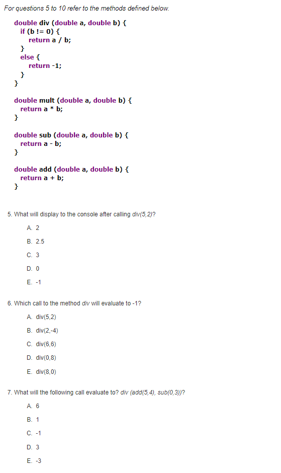
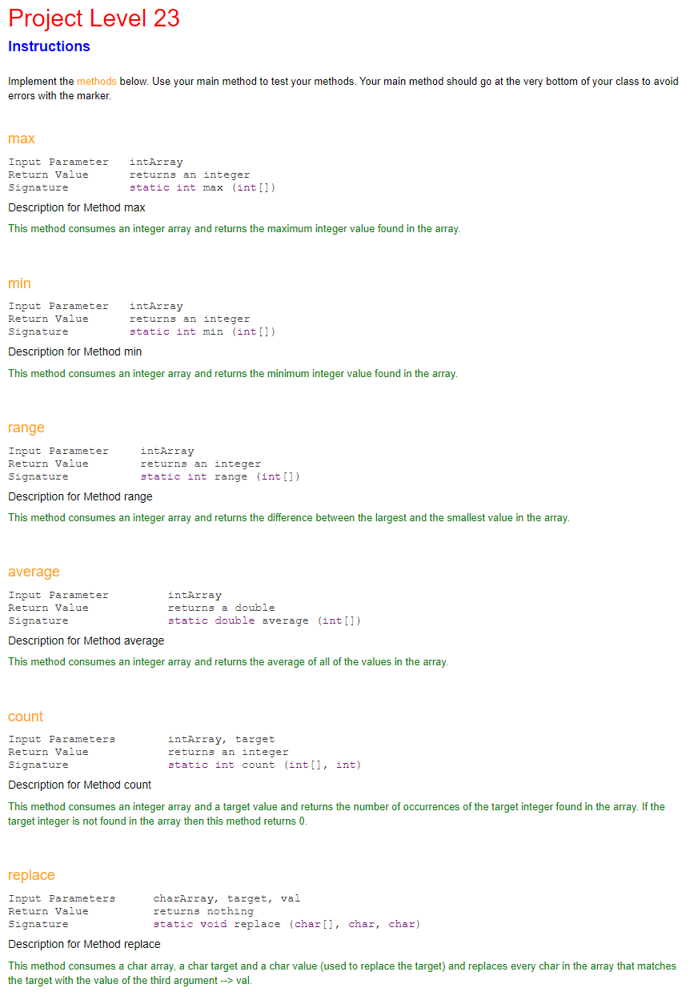

# Learn-Java
This is the code I made for learning Java during the course Computer Programming 11.

Some levels were not included in the project because they were just multiple choice questions as shown below:

The rest of the levels were meant to solve little puzzles like this to gain an understanding of Java:
